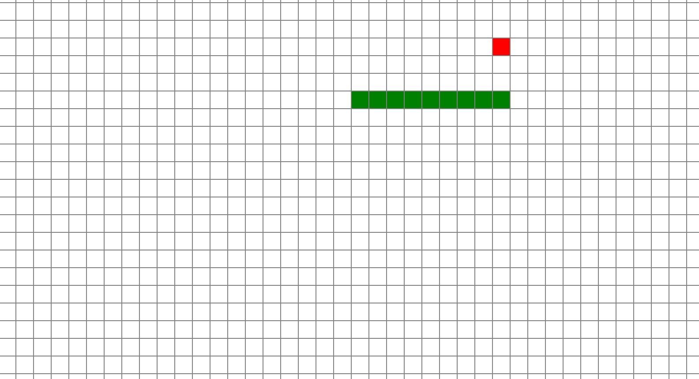
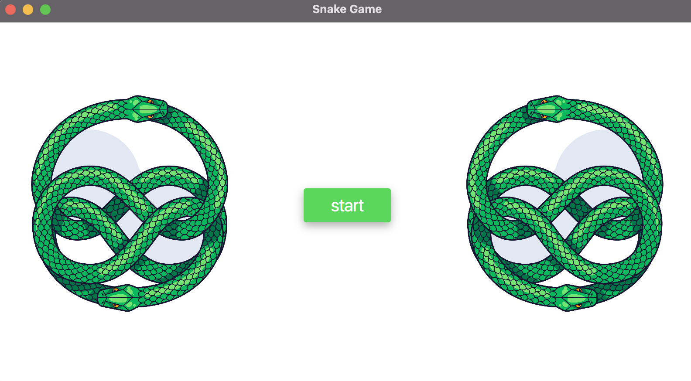
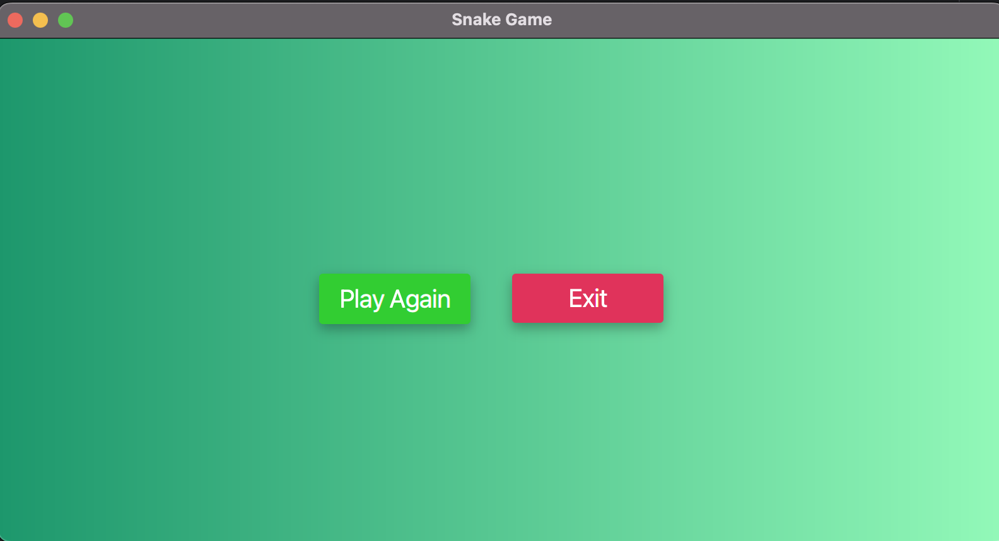

# Snake Game

Snake Game is a classic arcade-style game where you control a snake that grows in length as it consumes food. Try to achieve the highest score without running into walls or colliding with yourself!

## Table of Contents

- [Screenshots](#screenshots)
- [Features](#features)
- [Getting Started](#getting-started)
- [Controls](#controls)
- [Gameplay](#gameplay)
- [Development](#development)
- [License](#license)

## Screenshots

*Gameplay Screenshot*

*Play Game Screenshot*

*Play Again Screenshot*

## Features

- Classic Snake gameplay with a growing snake and food to collect.
- Simple and intuitive controls.
- Grid-based game board with clear visuals.

## Getting Started

To play the Snake Game locally, follow these steps:

1. Clone the repository to your local machine:`https://github.com/Thisarakavishka/Snake-Game.git`
2. Navigate to the project directory:

3. Compile and run the game using Java:

4. Use the arrow keys (Up, Down, Left, Right) to control the snake and collect food.

## Controls

- **Up Arrow**: Move the snake upwards.
- **Down Arrow**: Move the snake downwards.
- **Left Arrow**: Move the snake leftwards.
- **Right Arrow**: Move the snake rightwards.

## Gameplay

- The game starts with a snake of length 3 and a piece of food.
- Control the snake's direction to collect food.
- Each time the snake consumes food, it grows longer, and your score increases.
- The game ends when the snake collides with the game board's boundaries or itself.
- After the game ends, you can choose to play again.

## Development

The Snake Game is developed using Java and JavaFX. Here are some key details about the development:

- **Programming Language**: Java
- **GUI Framework**: JavaFX
- **Game Logic**: Grid-based movement, collision detection
- **Game Loop**: AnimationTimer for smooth gameplay

## License

This Snake Game is released under the [MIT License](LICENSE.txt).

---

**Note:** Feel free to customize this README with additional information about your game, development process, or any other details you'd like to share. Happy gaming!
